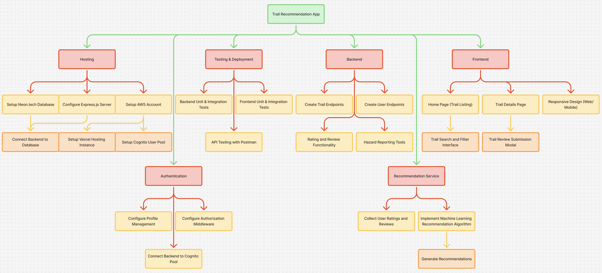
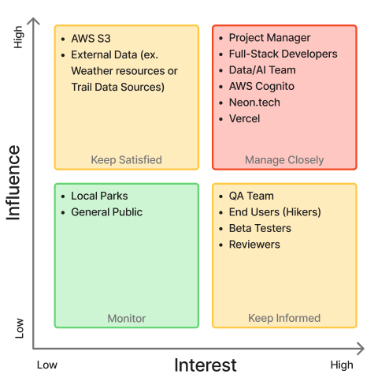

# HikeSphere

## 1. Introduction

HikeSphere is a web application designed to enhance the hiking experience by helping users discover trails that match their skills and preferences. Many people face the issue of finding new trails that suit their abilities, interests, and level of difficulty. This project aims to provide a user-friendly platform where hikers can log their experiences, rate trails, and receive recommendations, bringing forth an engaging hiking community.

_October 8th, 2025_

_Current Version: 1.0_

_Project Manager (and sponsor): (Name)_

## 2. Overview

HikeSphere aims to create a community-driven website for hikers to help with all trail-related problems.

### 2.1 Objective

- Provide a platform for hikers to record and share trail experiences.
- Offer detailed information for each trail, including but not limited to difficulty, conditions, wildlife, and hazards.
- Build a responsive, smooth, and user-friendly web app.

## 3. Milestones

1. Database Setup (Neon.tech SQL database with tables for trails and users)
2. Functional Front-End Interface (React.js pages and navigation)
3. Tested Back-End Server RESTful API (Express.js endpoints for trails and user data)
4. Trail Viewing and Filtering (users can view trail info and filter by specific categories including difficulty, name, and rating)
5. Trail Searching (users can quickly search for specific trails)
6. Tool for reviewing and rating trails
7. Tool for reporting of a specific trail
8. Tool for recommending trails to hikers
9. Tool for identifying trail hazards

### 3.1 Work Breakdown Structure

### 3.2 Requirements Traceability Matrix

| Req ID | Requirement                                                              | Del ID | Deliverable                                                    | Owner         | Status  |
| ------ | ------------------------------------------------------------------------ | ------ | -------------------------------------------------------------- | ------------- | ------- |
| REQ01  | Express server to be hosted with production and development environments | DEL01  | Hosting - Configure Express.js server                          | Backend Team  | planned |
| REQ02  | Database must be hosted and connected to the back end                    | DEL01  | Hosting - Setup Neon.tech DB and Connect to Backend            | Backend Team  | planned |
| REQ03  | Setup AWS cognito user pool and connect to backend                       | DEL02  | Authentication - Connect backend to cognito user pool          | Backend Team  | planned |
| REQ04  | Model setup of user profile                                              | DEL02  | Authentication - Configure Profile Management                  | Backend Team  | planned |
| REQ05  | Create unit tests for authentication                                     | DEL03  | Testing - Backend Unit and Integration tests                   | QA Team       | pending |
| REQ06  | Create unit tests for trail api calls                                    | DEL03  | Testing - Backend Unit and Integration tests                   | QA Team       | pending |
| REQ07  | Users can view a list of trails                                          | DEL06  | Frontend - Home Page (Trail Listing)                           | Frontend Team | planned |
| REQ08  | Users Search and filter trails                                           | DEL06  | Frontend - Home Page (Trail Listing)                           | Frontend Team | pending |
| REQ09  | Collect and clean rating/review data                                     | DEL05  | Recommendation Service - Collect user ratings and reviews      | Data/AI Team  | pending |
| REQ10  | Create ML model for recommendations                                      | DEL05  | Recommendation Service - Implement ML Recommendation Algorithm | Data/AI Team  | pending |

## 4. Deliverables

### 4.1 Set up

1. Neon.tech SQL database created, connected with backend, and provides sample trails.
2. Express.js backend deployed on Vercel.
3. React.js frontend deployed on Vercel.

### 4.2 Functionality

1. Backend provides RESTful API endpoints for all necessary data such as trails.
2. All backend and frontend environment variables correctly configured for production.
3. User can view, filter, and interact with dynamic trail data through the frontend interface.
4. AWS Cognito setup for secure user authentication on backend, and provides authorization tokens for frontend.

### 4.3 Testing

1. Continuous Integration configured in GitHub for automated build and tests.
2. Test suites setup implemented for backend and frontend.

### 4.4 Data Model

1. ML Model setup and integrated to provide trail recommendations to user.

### 4.5 Documentation

1. Complete documentation covering API endpoints, database schema, and project deployment steps.

## 5. Gantt Chart

## 6. Budget

1. Project is planned to be completed with 4 sprints, 2 weeks long over the next 8 weeks.
2. Project is estimating approximately 1 million monthly users (50% of the leading hiking app)

### 6.1 Personnel Costs

| Role                           | Members | Hours/Sprint | Hourly Rate   | Cost/Sprint | Total       |
|--------------------------------|---------|--------------|---------------|-------------|-------------|
| Full-Stack Developers (Junior) | 4       | 36           | $30           | $8,640      | $34,560     |
| Scrum Master                   | 1       | 36           | $50           | $1,800      | $7,200      |
| **Total**                      | -       | -            | -             | **$10,440** | **$41,760** |

### 6.2 Operational Costs

| Service                         | Cost/Month    | Cost/Annually   |
|---------------------------------|---------------|-----------------|
| Vercel (Frontend Host)          | $100          | $1,200          |
| Node/Express EC2 (Backend API)  | $150          | $1,800          |
| Python EC2 (ML Recommender API) | $100          | $ 1,200         |
| Neon.Tech (Database)            | $200          | $2,400          |
| AWS Cognito (User Management)   | $5,000        | $60,000         |
| AWS s3 Bucket (Image Storage)   | $50           | $600            |
| **Total**                       | **$5,600**    | **$67,200**     |

### 6.3 Hardware Costs 

| Item                 | Budgeted Allowance |
|----------------------|--------------------|
| Computer             | $1,500             |
| Monitor              | $150               |
| Peripherals          | $150               |
| Total per Developer  | $1,800             |

| Category              | Cost         |
|-----------------------|--------------|
| Total per Developer   | $1,800       |
| Number of Developers  | 4            |
| **Amount**            | **$7,200**   |

### 6.4 Subscriptions

| Subscription  | Monthly/Cost    | Duration (Months) | Cost per Developer |
|---------------|-----------------|-------------------|--------------------|
| Github Pro    | $4              | 2                 | $8                 |
| IDE           | $95             | 2                 | $190               |
| Figma Pro     | $15             | 2                 | $30                |
| Postman Pro   | $20             | 2                 | $40                |
| **Total**     | **$134**        | **2**             | **$268**           |

### 6.4 Grand Total

1. Estimated costs for 2 months in development and 1 year in production

| Item                        | Amount         |
|-----------------------------|----------------|
| Personnel (Development)     | $41,760        |
| Hardware (Development)      | $7,200         |
| Subscriptions (Development) | $268           |
| Operational (Production)    | $67,200        |
| **Total**                   | **$116,428**   |

| Item                 | Amount        |
|----------------------|---------------|
| Total                | $116,428      |
| Contingency (10%)    | $11,643       |
| **Grand Total**      | **$128,071**  |

## 7. Organization and Stakeholders

### 7.1 Stakeholders Analysis Matrix

